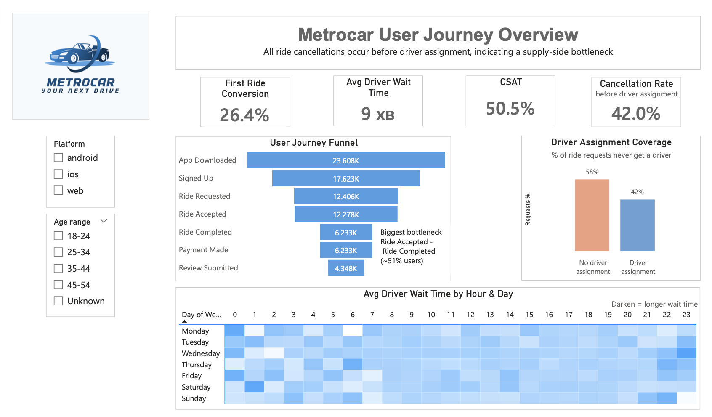

# 🚙 Metrocar — Funnel & Conversion Analysis

📅 Period: 2025-12-02 — 2026-01-10  
🛠 Tech: SQL, Power BI  
👩‍💻 Author: Olena Melnyk  

---

## 🎯 Business Problem

In a ride-hailing product, the first completed ride is the key activation event.

However:
- Only **26.4%** of users complete their first ride  
- **73.6% drop off before activation**  
- High cancellation rate (**42%**)  

👉 This directly impacts retention, marketing ROI, and revenue

---

## 🔍 Objective

Identify where users drop off in the funnel and determine the root cause of low conversion.

---

## 📊 Funnel Analysis

Main funnel stages:

App Download → Signup → Ride Request → Ride Accepted → Ride Completed → Payment → Review

### Key finding:
👉 Biggest drop-off:
**Ride Accepted → Ride Completed (~51%)**

---

## 🚨 Root Cause Analysis

### Critical insight:
👉 **58% of ride requests do NOT get a driver**  

- All cancellations happen **before driver assignment**
- This indicates a **supply-side problem**, not UX issue

📌 Conclusion:  
**Driver availability is the primary bottleneck limiting conversion**

---

## 📈 Supporting Metrics

- First Ride Conversion: **26.4%**
- Cancellation Rate: **42%**
- CSAT: **50.5%**
- Avg Wait Time: ~9 min  

---

**📊 Dashboard** [Open dashboard](https://app.powerbi.com/view?r=eyJrIjoiMTkyYTBkZTgtYTA1Mi00ZWYxLWFlNjItZDM4ZDY1N2FhMGMyIiwidCI6ImRmODY3OWNkLWE4MGUtNDVkOC05OWFjLWM4M2VkN2ZmOTVhMCJ9)

  

The dashboard includes:
- Funnel visualization  
- Conversion rates  
- Driver assignment coverage  
- Wait time heatmap  

---

## 🧠 SQL Analysis

SQL queries used:

- Conversion by age group  
- Conversion by platform  
- Cancellation rate  
- Driver wait time  
- CSAT  

📎 See SQL file in repository

---

## 🚀 Recommendations

### 1. Supply Optimization (High Impact)

- Increase driver availability in peak hours  
- Introduce dynamic incentives  
- Optimize driver distribution  

📊 Expected impact:
👉 +10–15% increase in first ride conversion

---

### 2. Product Improvements (Medium Impact)

- Show realistic ETA before driver assignment  
- Improve communication during driver search  

---

### 3. Marketing Strategy

- Optimize campaigns for **first completed ride**, not installs  

---

## 💡 Business Impact

If driver availability improves:

- Higher activation rate  
- Better retention  
- Increased revenue per user  

---

## 🛠 Tools

- SQL 
- Power BI(DAX)

